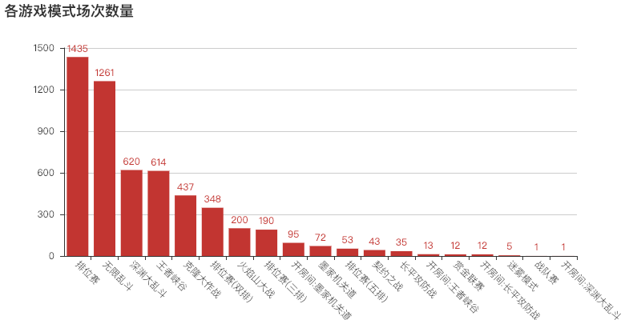
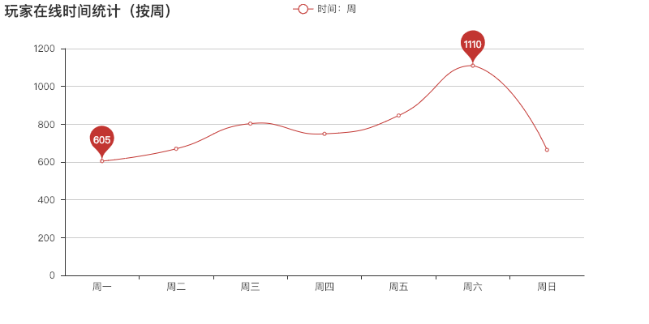

> 爬取了王者荣耀比赛数据，并对其进行整合、分析。

**关键词**：python3 、 王者荣耀 、charles、 mongoDB 、 pandas、pyecharts

### 00. 数据总览

- **数据来源**：王者荣耀助手APP（微信-android）
- **数据数量**：5447条（本来准备获取1万条数据，结果账号被封了……）
- **时间范围**：2018-11-05 至 2018-12-08
- **涉及玩家**：44944名

### 01. 各游戏模式场次统计

统计了各游戏模式的场次，使用 pyecharts 绘制了条形图，见下。

如图，排位赛和无限乱斗场次数量遥遥领先，看来大家还是喜欢玩这2种模式啊。

### 02. 在线时间统计

分别按小时、按周统计了玩家在线时间（取每场比赛的开始时间），绘制了折线图，见下。

看着这个统计结果，还是有点意外的。每天的在线高峰期竟然是在中午12点，难道……是因为小学生们放学了吗🤔。按周统计的结果中，周六是在线高峰期倒是可以理解，但周日玩家这么少，意外 +1 啊——难道……是因为小学生们要赶作业了🤔🤔

### 03. 最热门英雄

按各英雄上场次数进行统计，以王者荣耀的 logo 作为底图，绘制了词云图。

出场率最高的，后裔咯——不知道是否符合你的预期。

有价值的信息好像就这么多，也可能是我目光短浅，看不到其他信息的价值，暂且先分析这么多吧！

---

源代码：https://github.com/RamblerW/python3/tree/master/code/_20181126_analyze_pvp