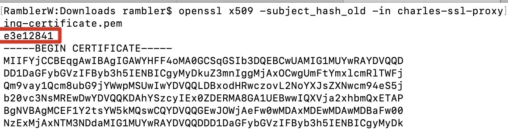

> **手机系统**：魅族Flyme 7.1.5.0A（Android版本：7.0）
>
> **工具软件**：RE文件管理器（用于查看系统文件路径）

### 00. 背景

手机升级为Android7后，使用charles进行抓包的时候，除手机浏览器外，其他APP的https请求均无法发送。

### 01. 原因

Android7.0 之后默认不信任用户添加到系统的CA证书，也就是说对基于 SDK24 及以上的APP来说，即使你在手机上安装了抓包工具的证书也无法抓取 https 请求。

### 02. 解决方案

网上看到的解决方案都是要修改手机的配置文件，看的一头雾水。官方文档：https://developer.android.google.cn/training/articles/security-config。

我是根据圈友分享的一篇帖子[Android 7.0 之后抓包 unknown 和证书无效的解决方案（无需改代码）](https://blog.csdn.net/ShadowySpirits/article/details/79756274)解决的。具体步骤如下：

- 电脑端

  1. **下载charles证书**：charles - Help - SSL Proxying - Save Charles Root Certificate…

  2. **获取证书名**：打开终端或cmd窗口，切换到证书目录下，执行命令：`openssl x509 -subject_hash_old -in charles-ssl-proxying-certificate.pem`，得到文件名，如图。

     

  3. **修改证书名**：修改证书文件名称为`e3e12841.0`或`e3e12841.1`（后缀名的数字是为了防止文件名冲突的）

- 手机端
  1. **获取ROOT权限**：设置 - 指纹、密码和安全 - ROOT权限，之后手机会重启。
  2. **安装RE文件管理器**：我是在https://www.wandoujia.com/apps/com.speedsoftware.rootexplorer下载的。
  3. **安装证书**：将电脑端得到的修改好名字的证书文件通过RE文件浏览器放置到`/system/etc/security/cacerts/`路径下。
  4. **启用证书**：有的手机可能还需要手动启用证书（我的手机不需要），操作：设置 - 安全 - 凭证 - 信任的凭证